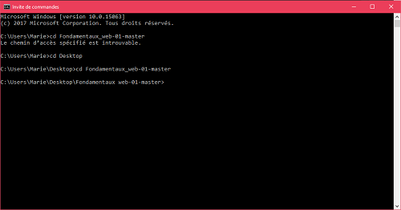
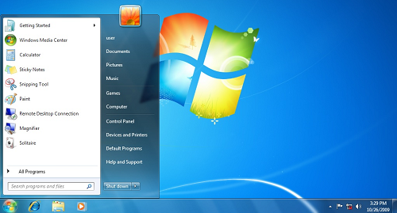

# Shell / Interface graphique, liste des commandes essentielles du shell

## Contributeurs :
* Pham Vincent: https://github.com/ShonhTan
* Yip Théodore: https://github.com/yip-theodore
* Te Marie: https://github.com/mariete36
* Papin Laure: https://github.com/enneade
* Mémeint Sophie: https://github.com/SophieChieko

## I -Introduction (Marie)

Le shell (en français “interface système” ou “coque logicielle”) est le programme qu’on utilise régulièrement sur les machines telles que Mac, PC etc, et qui interprète les commandes. C’est un outil en mode texte qui permet l’exploitation d’un grand nombre de ressources de l’ordinateur.

Le shell utilise 2 type d’interface :
* L'interpréteur en ligne de commande (CLI : command line interface).
* L'interface graphique (GUI: graphical user interface) comme l'explorateur Windows.

Sur Windows:
* l’interface graphique correspond à l’explorateur Windows.
*  L’interpréteur en ligne de commande est accessible depuis le Terminal (cmd.exe).

Depuis la sortie de Mac OS X, un système d'exploitation de la famille des Unix, les Mac disposent d'un shell qui est accessible par l'intermédiaire de l'utilitaire Terminal.
Terminal est particulièrement apprécié des utilisateurs avancés de Mac OS X pour personnaliser des fonctions système, créer des scripts shell et résoudre des problèmes de fonctionnement de Mac OS X.

 | 
:--: | :--:
Command Line Interface (Windows) | Graphical User Interface (Windows)

## II - Histoire (Laure)
Le terme anglais « shell » vient à l'origine de la terminologie employée avec les premiers systèmes d'exploitation de type Unix où il avait le sens plus spécifique de shell Unix. Cette appellation est une métaphore (on peut la traduire par coque en français) pour désigner la couche la plus haute des interfaces des systèmes Unix, par opposition à la couche de bas-niveau, appelée noyau.

Les premiers concepteurs informatiques américains avaient l’habitude de décrire les différentes couches logicielles d’un système par une analogie : celle du noyau et de la coque de noix.

L’expression très employée en anglais « in a nutshell » pour désigner l’essence d’un concept en un mot n’est pas étrangère à cette analogie.

Avec l'arrivée de la souris et des interfaces graphiques, cet anglicisme a fini par être démocratisé pour désigner tous les types d'interfaces entre l'homme et la machine (IHM) propre à chaque système d'exploitation, qu'elles soient textuelles ou graphiques.

**1971 -** Le premier shell est le Thompson shell (en) apparu avec la première version d’Unix et écrit par Ken Thompson, l'un des créateurs d'Unix. Il est remplacé par le Bourne shell, écrit par Stephen Bourne, en 1977 pour la version 7 d'Unix.

**1978 -** Bill Joy, alors étudiant à l'Université de Californie à Berkeley, crée csh (C shell), une évolution du shell dont la syntaxe s'inspire de celle du langage C. Il permet notamment la réutilisation de l'historique des commandes. Une version plus moderne du csh est ensuite publiée sous le nom tcsh.

**1983 -** Le Korn shell (ksh) est publié par David Korn. Il est compatible avec le Bourne shell, reprend certaines fonctionnalités de csh et ajoute des fonctions de scripts avancées disponibles dans des langages plus évolués tel que le Perl.

**1988 -** Le Bourne-Again shell (bash) apparait. Il est écrit par Brian Fox pour la Free Software Foundation dans le cadre du projet GNU. C'est le shell de nombreuses implémentations libres d'Unix, tel que les systèmes GNU/Linux. Il est compatible avec le Bourne shell dont il se veut une implémentation libre.

**1990 -** Paul Falstad crée Zsh alors qu'il est étudiant à l'université de Princeton. Ce shell reprend les fonctions les plus pratiques de bash, Csh, tcsh.

## III - Différences entre le shell/console/terminal (SOPHIE) :

Le shell n’est pas exactement la même chose que la console et le terminal.
Le terminal se connecte à la console qui utilise le shell.
On peut accéder au shell soit par le terminal, soit par la console.
Le shell est donc une interface logicielle et le terminal et la console sont des application qui servent à interagir avec un shell. C’est le shell qui est le programme qui interprète les lignes de commandes tandis que le terminal ou la console sont de simples tableaux qui permettent de l’ouvrir.

## IV - Différences entre le Shell sur Mac/Linux et le Shell sur Windows (SOPHIE)

Le shell de Mac utilise les lignes de commande Unix alors que celui de Windows non.
Le shell qui s’ouvre par défaut dans le terminal est bash, alors que dans le shell de Windows, c’est cmd.exe ou Powershell. Chaque shell a sa propre syntaxe comme nous allons le voir.

## V - Le Shell sur Mac (THEO)
### :file_folder: [ Repertoires ]

ALLER À              ||
-------------------- | ----------------------------------------------
**cd** */path*  | dans le répertoire spécifié
**cd**               | retourner sur la home
**cd ..**	           | retourner dans le répertoire parent

CRÉER            ||
---------------- | --------------------------------------------------
**mkdir** dir | créer un répertoire nommé *dir*

AFFICHER    ||
----------- | -------------------------------------------------------
**pwd**     | le chemin du répertoire courant
**ls -ld**	|	la description du répertoire courant
**ls**      |	le contenu
**ls -l**	  |	la description du contenu
**ls -a**	  |	tout le contenu (même les fichiers cachés)
**ls -R**	  |	récursivement (intégralement) le contenu

SUPPRIMER          ||
------------------- | ----------------------------------------------
**rm -rf** dir/ | supprime *dir/*

### :page_facing_up: [ Fichiers ]
CRÉER                    ||
------------------------- | ----------------------
**touch** file.txt      | créer un fichier

AFFICHER                    ||
------------------------- | ----------------------
**cat** file.txt      | le contenu de *file.txt*

COPIER                    ||
------------------------- | ----------------------
**cp -i** file1 file2      | copie le contenu de *file1* dans *file2*

DÉPLACER / RENOMMER                    ||
------------------------- | ----------------------
**mv** file.txt */path* | déplace *file.txt* vers */path*
**mv** file.txt file2.txt      | renomme *file.txt* par *file2.txt* (si ça existe déjà, ça l'écrase)

SUPPRIMER          ||
------------------- | ----------------------------------------------
**rm -f** file.txt | supprime *file.txt*

### :zap: [ Bonus ]
AIDE ||
--- | ---
**man** echo | Affiche la doc de la commande [ **q** pour quitter ]

DIVERS                 ||
---------------------- | ------------------------------------------------
variable**=**salut       | créer une variable
**echo $**variable     | afficher le contenu de la variable
**banner $**variable    | c tré coul
**rm -rf /***       | :skull: :skull: :skull: :skull: :skull:

TIPS               ||
------------------ | ------------------------------------------------
*{up/down arrows}* | ré-afficher les commandes précédentes
*{tab}*     | auto-complète

## VI - Le Shell sur Windows (cmd.exe)
### :file_folder: [ Repertoires ]

Créer            ||
---------------- | -----------------------------
**mkdir** dir    | créer un répertoire nommé *dir*

Naviguer   ||
---------- | -------------------------------
**cd** dir | change de répertoire courant (change directory)
**cd** ..  | change vers le répertoire parent
**D:**     | change de disque vers le D:
**C:**     | change de disque vers le C:

Afficher      ||
------------- | --------------------------------
**dir**       | afficher tous les répertoires/fichiers présents dans le répertoire courant
**dir** /a:d  | afficher seulement les répertoires
**dir** /b    | afficher en format abrégé (seulement les noms)
**dir** /o:s  | afficher avec tri par taille
**dir** /o:-s | afficher avec tri par taille en ordre décroissant
**dir** /o:e  | afficher avec tri par extension
**tree**      | afficher l’arborescence des répertoires présents dans le répertoire courant
**tree** /f   | afficher l’arborescence + les fichiers
...           | ...

### :page_facing_up: [ Fichiers ]

Copie                             ||
--------------------------------- | ---------------------------------------
**copy** nomfichier1 nomfichier   | copie nomfichier1 et nomme le nouveau fichier en nomfichier2

Supression                        ||
--------------------------------- | ---------------------------------------
**del** nomfichier (nomfichier2…) |	supprimer le(s) fichier(s)
**del** /f nomfichier             | forcer la suppression
**del** exemple*                  | supprime tous les fichiers dont le nom commence par *exemple*
**rmdir** nomdurepertoire         | supprimer le répertoire vide
**rmdir** /S nomdurepertoire      | supprimer le répertoire non vide

### :zap: [ Bonus ]
DIVERS                            ||
--------------------------------- | ---------------------------------------
**help**                          | afficher une liste de commande utilisable ainsi que leur description

## VII -  Conclusion

Les interfaces graphiques, c’est bien. Vive le **GUI**.
